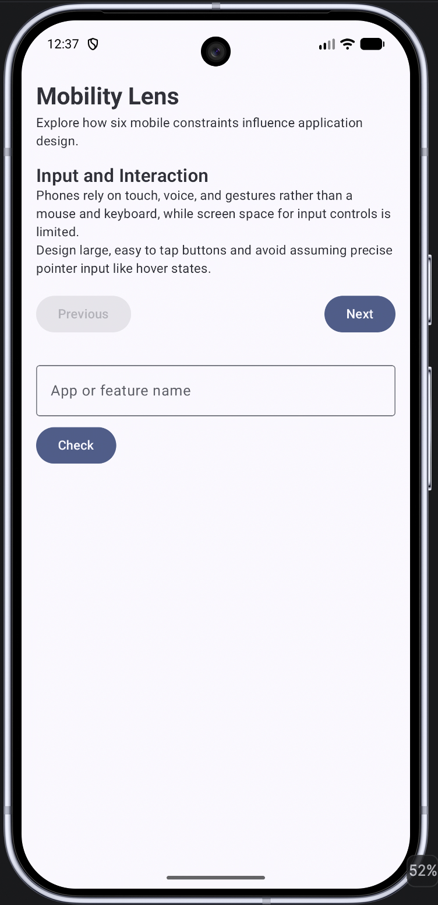
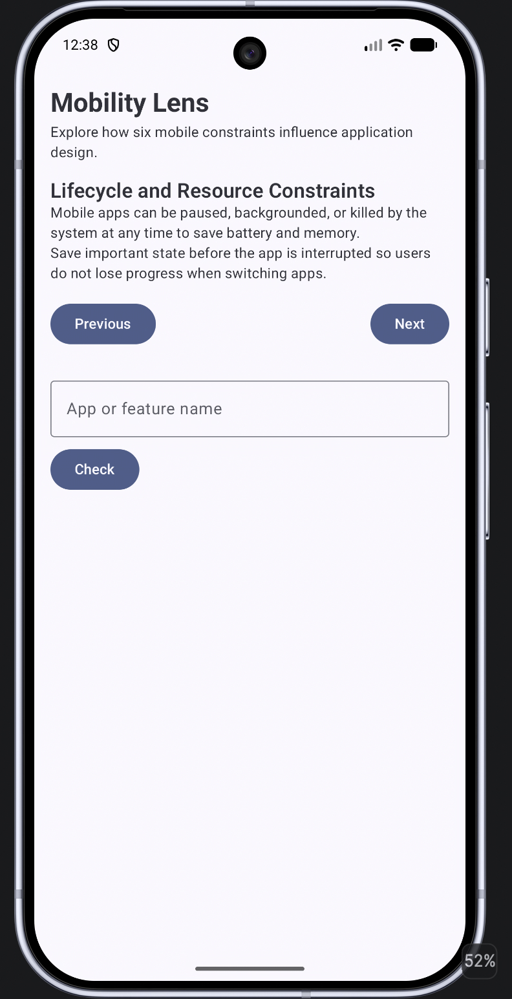
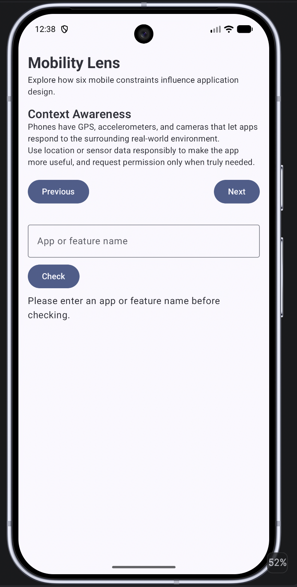
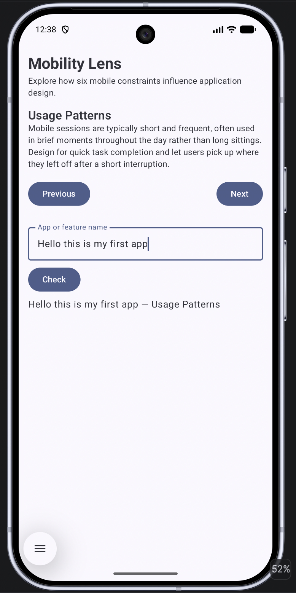

# Mobility Lens

An Android application built with Kotlin and Jetpack Compose for CS501 Individual Coding Assignment 1. Mobility Lens walks a developer through the six dimensions that distinguish mobile applications from stationary applications, letting the user step through each dimension and check how a given app or feature name relates to it.

**Author:** Srinivasa Sai Chava
**BU ID:** U44607487
**Package name:** `edu.bu.saichava.mobilitylens`

---

## Features

- Displays one mobility dimension at a time (name, description, and a practical developer implication), with Previous/Next controls to move through all six dimensions.
- Introduces the purpose of the application beneath the title.
- An `OutlinedTextField` where the user can enter the name of an app or feature they are designing.
- A Check button that validates the entered text and shows a message combining it with the currently selected dimension, or a warning if the field is left blank.
- Custom Material typography for clear visual hierarchy on a small screen.
- A vertically scrollable layout that remains usable on smaller or rotated screens.
- Six mobility dimensions, each with its own title, description, and implication, all backed by `strings.xml` resources.

---

## Emulator Used

- **Device:** Pixel 10 Pro
- **API level:** 37.1

---

## SDK Configuration

| Setting      | Value                  |
| ------------ | ---------------------- |
| `minSdk`     | 26 (Android 8.0, Oreo) |
| `targetSdk`  | 37                     |
| `compileSdk` | 37                     |

**Why these settings:**

- **`minSdk` (26):** The oldest Android version the app is allowed to install on. API 26 was chosen because it still covers roughly 98% of active devices while giving full support for modern Jetpack Compose APIs, with no compatibility workarounds needed.
- **`targetSdk` (37):** Tells the system which Android version the app was designed and tested against, so the OS applies that version's behavior and compatibility rules instead of falling back to older, deprecated defaults.
- **`compileSdk` (37):** Sets which version of the Android SDK libraries the code is compiled against, giving access to the newest APIs and lint checks. It is generally kept at or above `targetSdk`.

---

## Key Files and Their Purpose

| File                             | Location                                                         | Purpose                                                                                                                                                                                                                               |
| -------------------------------- | ---------------------------------------------------------------- | ------------------------------------------------------------------------------------------------------------------------------------------------------------------------------------------------------------------------------------- |
| **MainActivity.kt**              | `app/src/main/java/edu/bu/saichava/mobilitylens/MainActivity.kt` | The app's entry point. Its `onCreate()` sets the Compose content, wrapping the UI in the custom theme and a `Scaffold`.                                                                                                               |
| **AndroidManifest.xml**          | `app/src/main/AndroidManifest.xml`                               | Declares the app's components, including `MainActivity` as the launcher activity, plus the app's icon and label. This app requests no permissions, since it uses no sensors, network, or storage.                                     |
| **build.gradle.kts** (app-level) | `app/build.gradle.kts`                                           | Configures how the app module builds: namespace, `applicationId`, the `minSdk`/`targetSdk`/`compileSdk` values, the Compose build feature, and the library dependencies.                                                              |
| **Version catalog**              | `gradle/libs.versions.toml`                                      | Centralizes dependency names and versions in one file, so `build.gradle.kts` can reference them (e.g., `libs.androidx.compose.ui`) instead of hardcoding version strings.                                                             |
| **strings.xml**                  | `app/src/main/res/values/strings.xml`                            | Stores all user-facing text as named string resources, referenced in Kotlin via `R.string.*`. This project defines 26 entries covering the introduction, six mobility dimensions, navigation buttons, input label, and validation feedback. |

---

## Rotation Observation

To test this, I navigated to a dimension other than the first, typed text into the app-name field, tapped **Check** to display a feedback message, and then rotated the emulator.

After rotating, the screen reset completely: the selected dimension returned to the first one, the typed text disappeared, and the feedback message was gone. None of the three pieces of UI state survived the rotation.

**Why this happens:** rotating counts as a configuration change, and by default Android destroys and recreates the Activity when one occurs, re-running `onCreate()` as if the app had just launched. `currentIndex` is declared with `remember { mutableIntStateOf(0) }`, while `appName` and `feedbackMessage` use `remember { mutableStateOf(...) }`. These state holders survive recomposition within the same Activity instance, but they do not survive Activity destruction and recreation. Preserving this would require `rememberSaveable` instead, which writes values into the saved-instance-state bundle handed back to the recreated Activity. This matters in real apps because a user who rotates their phone, or whose app is briefly killed by the system to free memory, should not lose in-progress input or their place in a multi-step flow.

---

## Mobile Design Decision

One deliberate mobile-appropriate decision was customizing the app's typography rather than leaving the default Material styles untouched. The `headlineMedium` and `titleLarge` styles were given a bolder weight, a larger size, and slightly wider letter spacing, so the app title and the current dimension name clearly stand out from the body text on a small screen. Because phone screens are small and users scan content quickly, a clear visual hierarchy with only a few text sizes lets users immediately identify which dimension they are viewing, which matters far less on a desktop application with a large screen and room for supplementary navigation like sidebars or breadcrumbs.

---

## Screenshots

| Running application on the first dimension             | A different dimension after user interaction                   |
| ------------------------------------------------------ | -------------------------------------------------------------- |
|  |  |

| Validation response to blank input                       | Successful response to valid input                   |
| -------------------------------------------------------- | ---------------------------------------------------- |
|  |  |

---

## Project Structure

```
MobilityLens/
├── app/
│   ├── src/main/
│   │   ├── java/edu/bu/saichava/mobilitylens/
│   │   │   ├── MainActivity.kt
│   │   │   ├── MobilityDimension.kt
│   │   │   ├── MobilityLensScreen.kt
│   │   │   └── ui/theme/
│   │   │       ├── Color.kt
│   │   │       ├── Theme.kt
│   │   │       └── Type.kt
│   │   ├── res/values/strings.xml
│   │   └── AndroidManifest.xml
│   └── build.gradle.kts
├── gradle/libs.versions.toml
├── screenshots/
└── README.md
```

---

## Collaboration Disclosure

I did not collaborate with any classmates on this assignment.

---

## Generative AI Disclosure

**Tool or model used:** Claude, an AI assistant developed by Anthropic, accessed through the claude.ai web interface.

**Prompts:** Prompts I used included:

- Explaining the code for Previous/Next buttons that update the currently shown dimension using Compose state, with the buttons disabled at the first and last dimension.
- Explaining the code for an `OutlinedTextField` and a Check button that validates blank input and combines the entered text with the current dimension name.
- Diagnosing why a build error occurred in `strings.xml` and how to fix it.
- Revising, and Grammar Correction for the written report and this README.

**Relevant suggestions it produced:** Claude explained core Compose concepts such as `remember`, `mutableStateOf`, `Modifier`; the Previous/Next navigation row, the `OutlinedTextField`, and the validation button; produced a customized `Type.kt` with bolder headline/title text styles; and identified that a build error was caused by an unescaped apostrophe in a `strings.xml` entry.

**What I accepted, changed, or rejected:** I accepted the overall Compose state pattern (`remember`/`mutableStateOf`). I wrote the six dimension descriptions and developer-implication text in `strings.xml` entirely in my own words rather than using Claude. I changed one suggested variable declaration from `var` to `val` after Claude explained why `val` was more appropriate there. I accepted the apostrophe/build-error fix and the unused-import cleanup after understanding why each was needed.

**How I verified the resulting code:** After each change, I ran the app on the Pixel 10 Pro emulator in Android Studio and manually tested the specific behavior involved: tapping Next/Previous through all six dimensions and confirming the buttons disabled at each end, typing into the text field and tapping Check with both blank and valid input, and rotating the emulator to observe and confirm the state-loss behavior described in the Rotation Observation section above. I read through each generated file myself before accepting it. I confirmed that the project built successfully with no errors. The remaining lint notices only identify newer dependency versions.
